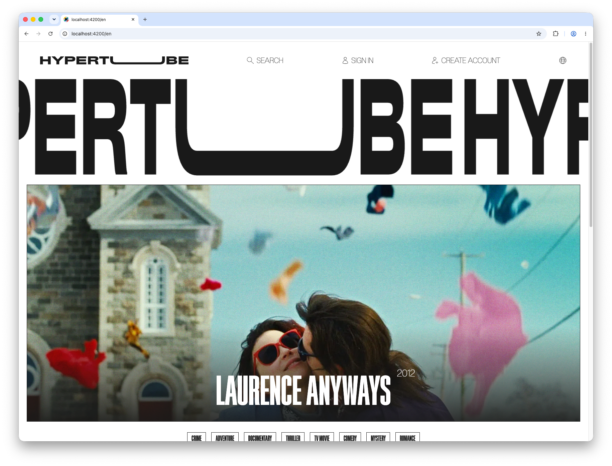
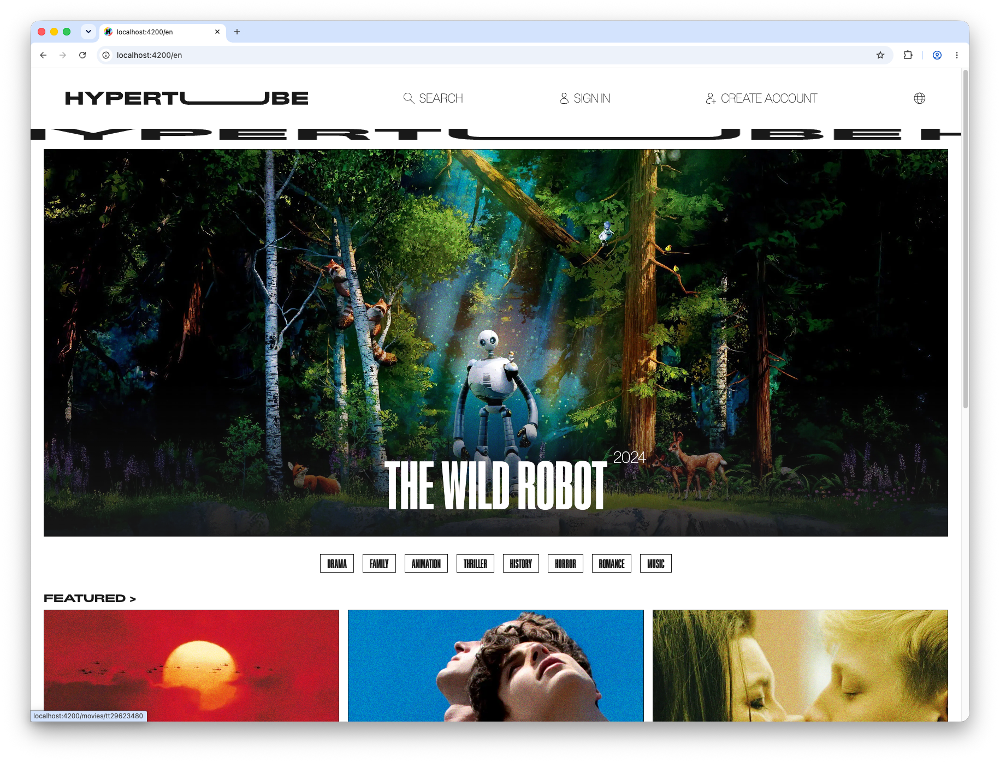
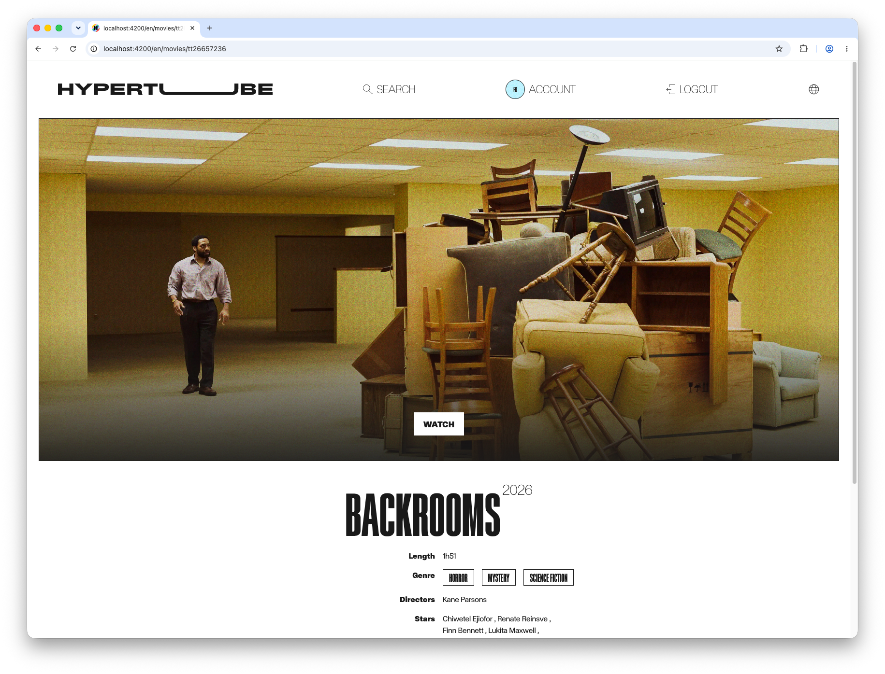
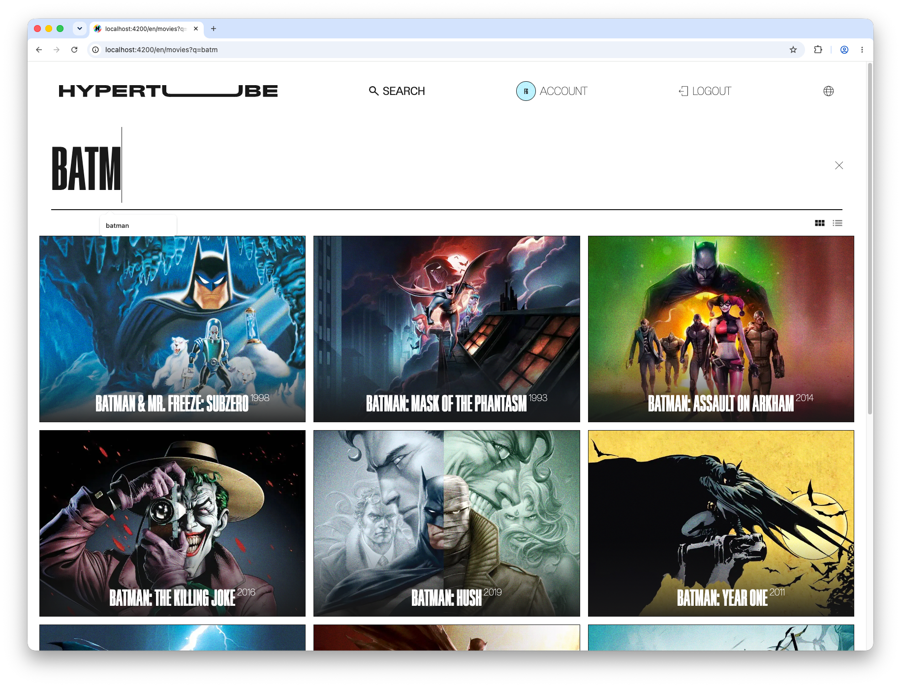
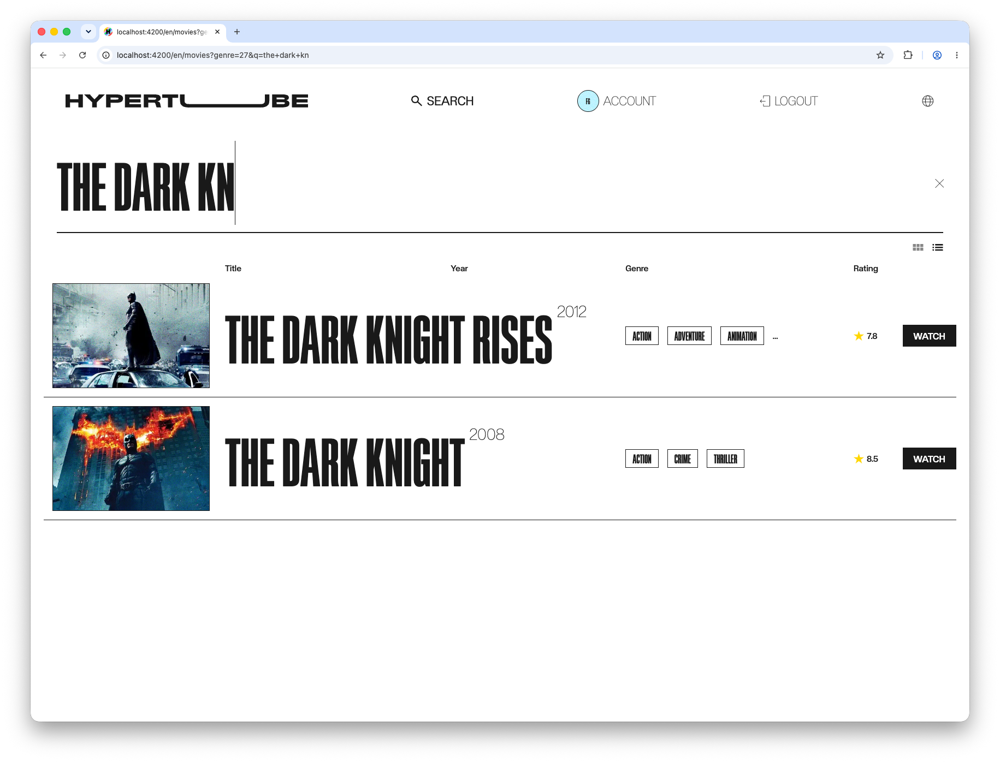
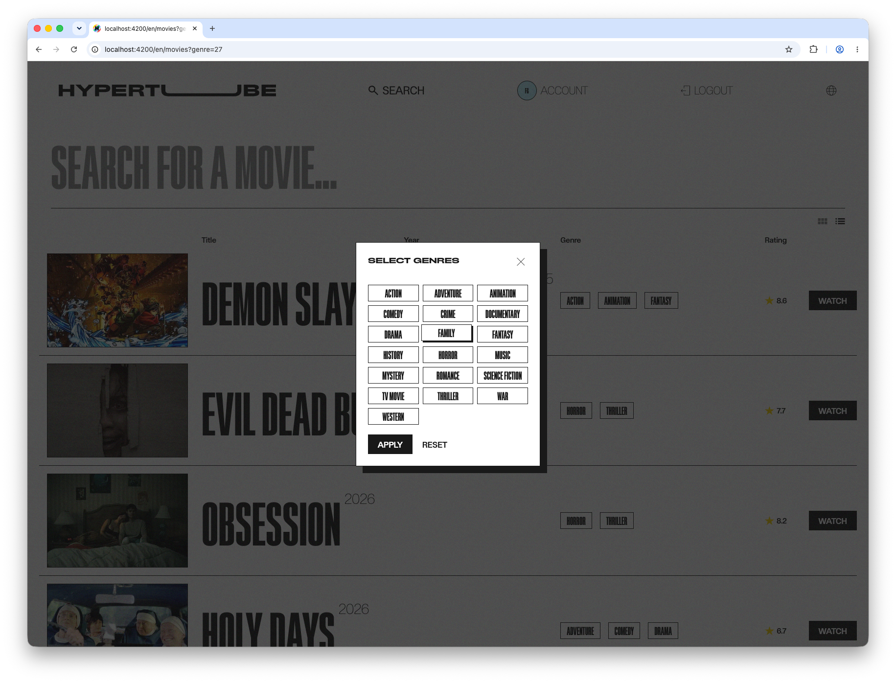
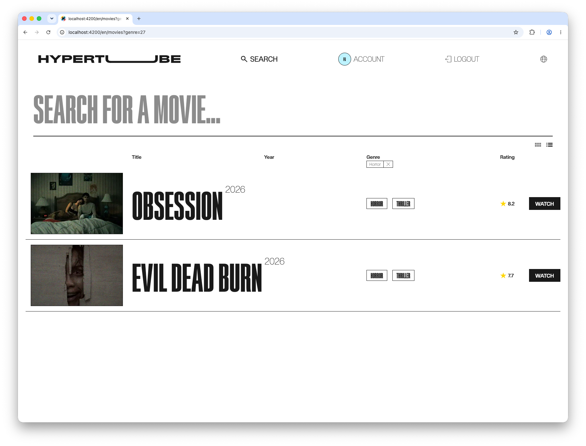
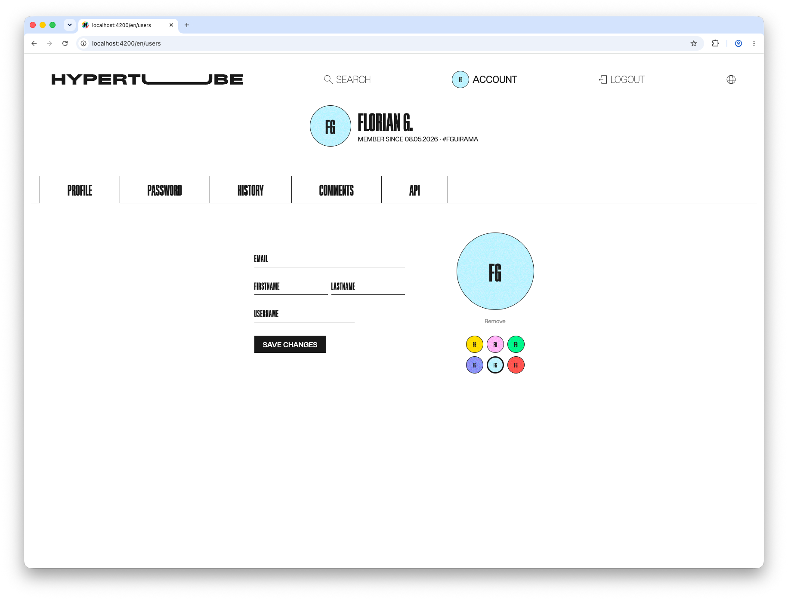
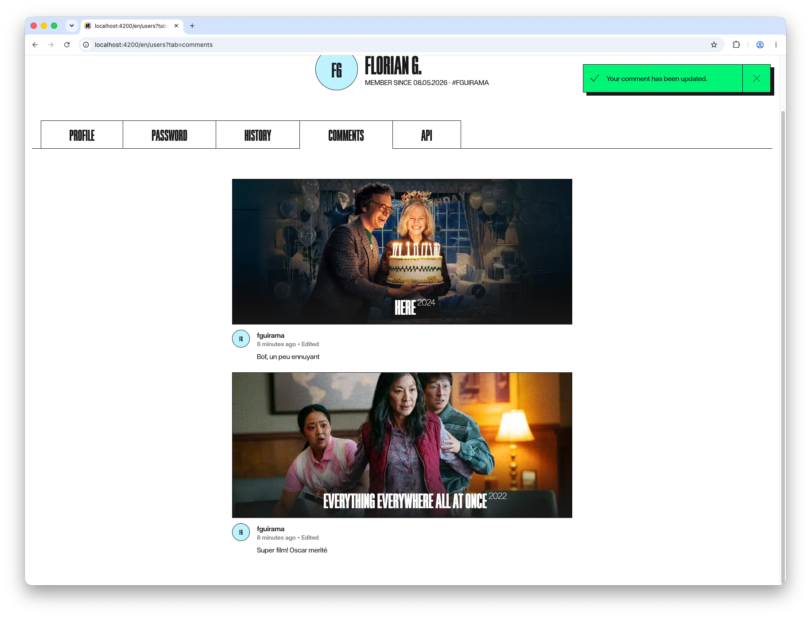

# HyperTube

HyperTube is a 42 school project: a movie discovery and streaming platform that searches torrents, enriches results with metadata, starts playback before the full download is finished, and keeps the torrent traffic inside a VPN.


## What it does

- searches movies from torrent sources and enriches them with TMDb data
- lets users browse, filter, and search titles in grid or list mode
- streams videos through HLS with `hls.js`
- supports watch progress, comments, user profiles, and watch history
- handles authentication with email/password and OAuth providers
- runs torrent traffic through Gluetun + OpenVPN
- removes old videos automatically

## Screenshots

<table>
  <tr>
    <td></td>
    <td></td>
  </tr>
  <tr>
    <td></td>
    <td></td>
  </tr>
  <tr>
    <td></td>
    <td></td>
  </tr>
  <tr>
    <td></td>
    <td></td>
  </tr>
  <tr>
    <td></td>
    <td></td>
  </tr>
</table>

## Stack

| Layer | Technology |
|---|---|
| Frontend | Next.js 16, React 19, App Router, `next-intl`, TanStack Query, Tailwind CSS 4, `hls.js` |
| API | Go with `chi` |
| Torrent / transcode | Go, `anacrolix/torrent`, `ffmpeg` |
| Database | PostgreSQL 16 |
| VPN | Gluetun + OpenVPN (Private Internet Access) |
| Local orchestration | Docker Compose |

## Architecture

```text
browser (Next.js frontend)
  -> REST API /api/v1/*
api service (:8080)
  -> auth, users, comments, movies, stream
  -> shared /data volume
torrent-transcode service (:8081, behind VPN)
  -> torrent download
  -> ffmpeg HLS transcode
VPN container
  -> all torrent traffic
postgres (:5432)
```

The API and torrent-transcode services share `srcs/data/`. Torrents are downloaded and transcoded into `srcs/data/videos/{id}/`, then the API serves the HLS playlist and segments to the browser.

## Prerequisites

- Docker and Docker Compose
- Go, Node.js, and npm for local development outside containers
- valid API keys and credentials for the services you want to use

## Configuration

Create `srcs/.env` from the provided template and fill in the required values:

```bash
bash launch.d/01generatePasswordsAndKeys.sh
```

This script copies `.env.exemple` to `srcs/.env` and generates the main secrets such as `POSTGRES_PASSWORD` and `JWT_SECRET`.

At minimum, review these groups of variables:

- database: `POSTGRES_USER`, `POSTGRES_PASSWORD`, `POSTGRES_DB`, `DATABASE_URL`
- metadata and search: `TMDB_API_KEY`, `C411_API_KEY`
- auth: `FORTYTWO_*`, `GITHUB_*`, `GITLAB_*`, `JWT_SECRET`
- email reset: `BREVO_API_KEY`, `MAIL_FROM_EMAIL`, `MAIL_FROM_NAME`, `PASSWORD_RESET_URL`
- VPN: `PIA_USER`, `PIA_PASSWORD`, `PIA_REGION`
- subtitles: `NEXT_PUBLIC_OPENSUBTITLES_*`

## Run locally

Start the backend stack:

```bash
make
```

Useful Makefile commands:

```bash
make up
make build
make down
make logs
make logs SERVICE=api
make exec SERVICE=api
make ps
make detach
make clean
make vclean
make fclean
make re
```

## Ports

| Service | Port |
|---|---|
| PostgreSQL | 5432 |
| API | 8080 |
| torrent-transcode | 8081 |
| frontend | 4200 |

## API summary

Base path: `/api/v1`

- public: `GET /health`, auth routes, movie search/listing, OAuth start/callback, token endpoint
- protected: watched movies, movie details, comments, progress, users, streaming

Full auth request and response examples live in `srcs/requirements/api/README.md`.

## Repository layout

```text
.
├── README.md
├── Makefile
├── .env.exemple
├── .img/
├── launch.d/
└── srcs/
    ├── docker-compose.yml
    ├── data/
    └── requirements/
        ├── api/
        ├── db/
        ├── frontend/
        └── torrent-transcode/
```

## 👥 Authors

- **fguirama** (Florian Guiramand)
- **jubernar** (Jules Bernard)
- **ohoro** (Omio Ohoro)
